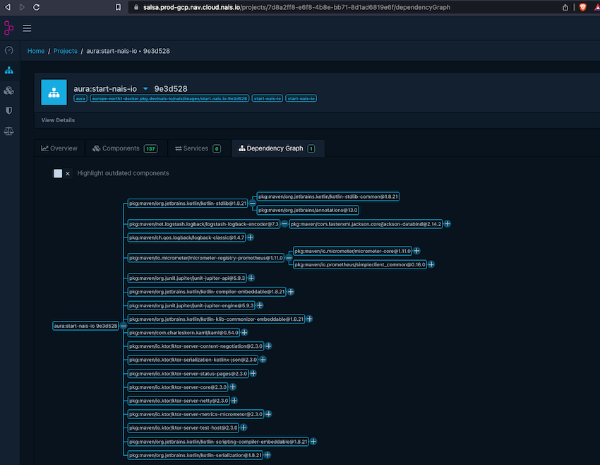

# Salsa

!!! info "Status: Beta"
    This feature is only in a beta.

    **Experimental**: users report that this component is working, but it needs a broader audience to be battle-tested properly.

    Report any issues to the #nais channel on Slack.

## What is SLSA

[SLSA](https://slsa.dev/) is short for _Supply chain Levels for Software Artifacts_ pronounced `salsa`.

It’s a security framework, a check-list of standards and controls to prevent tampering, improve integrity, and secure
packages and infrastructure in our projects.

## SLSA in NAIS

If you use the [nais/docker-build-push](https://github.com/nais/docker-build-push) action to build and push your container image, you will automatically get a signed
attestation/SBOM (Software Bill of Materials) of your container image and its dependencies. The SBOM will be uploaded to your container
registry alongside your image. The attestation is generated by the [Trivy](https://github.com/aquasecurity/trivy-action) github action and signed using [cosign](https://github.com/sigstore/cosign). 

When you deploy your image to NAIS the attestation will be verified by the NAIS platform ([picante](https://github.com/nais/picante)) and uploaded to a SBOM analysis plattform 
called [Dependency-Track](https://dependencytrack.org/). In Dependency-Track you can see the attestation and the vulnerabilities in your image and its dependencies.

### Usage

Simply add [nais/docker-build-push](https://github.com/nais/docker-build-push) to your workflow.

```yaml
          - uses: nais/docker-build-push@v0
            id: docker-push
            with:
              team: myteam # required
              salsa: true # optional, defaults to true
              project_id: ${{ vars.NAIS_MANAGEMENT_PROJECT_ID }} # required, but is defined as an organization variable
              identity_provider: ${{ secrets.NAIS_WORKLOAD_IDENTITY_PROVIDER }} # required, but is defined as an organization secret
            # ... other options removed for readability
              
```

!!! Opt-out
    Opt-out from salsa

    If you want to opt-out from salsa you can set the salsa input to false

    ```yaml
              salsa: false
    ```

See [nais/docker-build-push](https://github.com/nais/docker-build-push) for more options.


### View and analyze dependencies

[Dependency-Track](https://dependencytrack.org/) is deployed to each NAIS cluster (GCP only) and contains attestations and vulnerabilities for all images deployed to the cluster (which have not opted out from salsa).

You can access the Dependency-Track UI at the following URL:

* https://salsa.[clustername].[tenantname].cloud.nais.io

**Example**: [https://salsa.prod-gcp.nav.cloud.nais.io](https://salsa.prod-gcp.nav.cloud.nais.io)

You must login using the **OpenID** button which will redirect you to your organizations identity provider.

Each container in a deployment will have its own project in Dependency-Track. The project name consist of the team name, application name and the container image name.
You can search in projects with the following tags:

 * team
 * application
 * image

Here is a screenshot of a project using the dependency graph in Dependency-Track:



[Dependency-Track](https://dependencytrack.org/) has a ton of features so check out the [documentation](https://docs.dependencytrack.org/) for more information.

### Language support

SBOM generation for different [languages/build tools are dictated by Trivy](https://aquasecurity.github.io/trivy/v0.40/docs/scanner/vulnerability/language/)

#### Known limitations

* **Gradle**: Due to Trivy, we can only generate SBOMs from gradle projects if you use [dependency locking](https://docs.gradle.org/current/userguide/dependency_locking.html)


